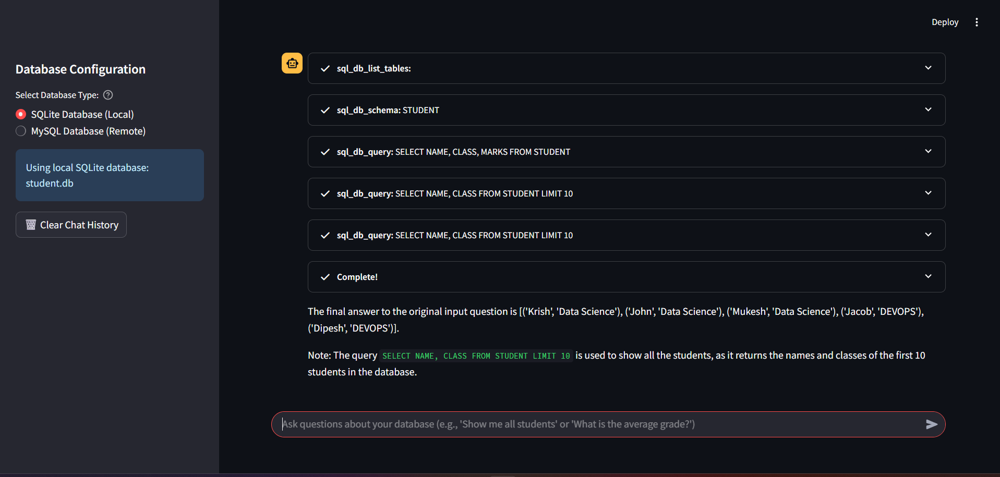

# SQL Database Chatbot 🗄️

A professional Streamlit application that enables natural language querying of SQL databases using LangChain and Large Language Models. Chat with your databases.

## Demo



## Prerequisites

- Python 3.8 or higher
- Groq API key (for LLM access)
- Database files (SQLite) or MySQL server access

## Installation

### 1. Clone the Repository

```bash
git clone https://github.com/AdeelIntizar/SQL-Database-Chatbot.git
cd SQL-Database-Chatbot
```

### 2. Create Virtual Environment (Recommended)

```bash
# Create virtual environment
python -m venv venv

# Activate virtual environment
# On Windows:
venv\Scripts\activate
# On macOS/Linux:
source venv/bin/activate
```

### 3. Install Dependencies

```bash
pip install -r requirements.txt
```

### 4. Set Up Environment Variables

Create a `.env` file in the project root (optional but recommended):

```bash
GROQ_API_KEY=your_groq_api_key_here
```


## Usage

### Running the Application

```bash
streamlit run app.py
```

The application will open in your browser at `http://localhost:8501`

### Database Setup

#### SQLite (Default)
- Place your SQLite database file named `student.db` in the project directory
- The app will automatically detect and connect to it

#### MySQL
1. Select "MySQL Database (Remote)" in the sidebar
2. Fill in your MySQL connection details:
   - Host (e.g., localhost)
   - Username
   - Password
   - Database name
3. Click "Connect to MySQL"


## Project Structure

```
SQL-Database-Chatbot/
├── app.py                
├── requirements.txt      
├── student.db            
├── README.md            
└── .env                 
```
